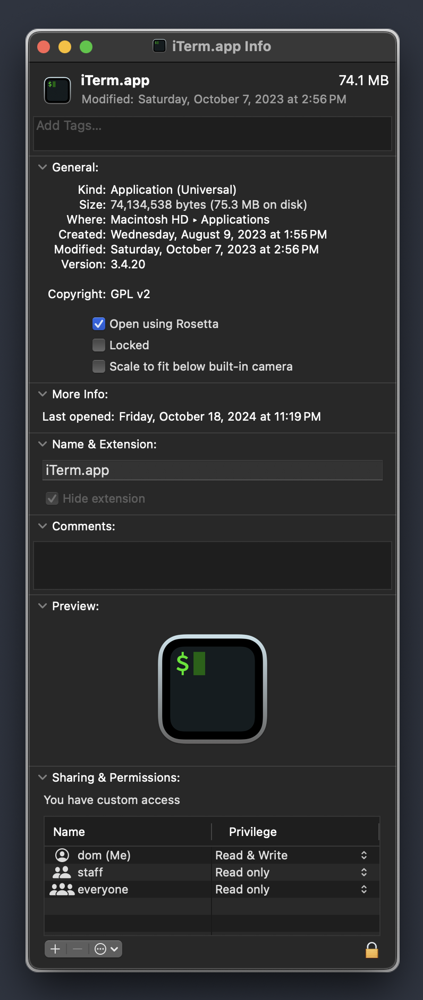

## M1 Mac Struggles

To help prevent avoid some issues with incompatibilities I actually have two terminals, one ARM copy that I downloaded from the iTerm2 website and another that I made by right clicking on the application and selecting "Get Info", then select "Open Using Rosetta"

## QMK Issues

I was recently having issues with QMK on the ARM version of `brew` and I found this very helpful article: https://codetinkering.com/switch-homebrew-arm-x86/
